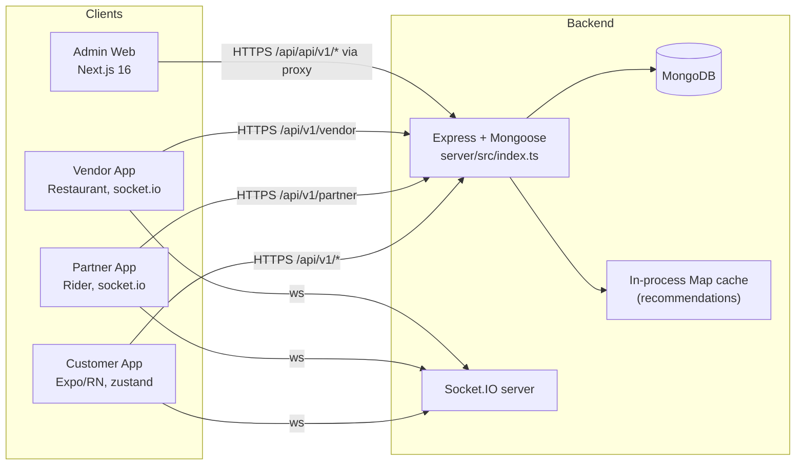
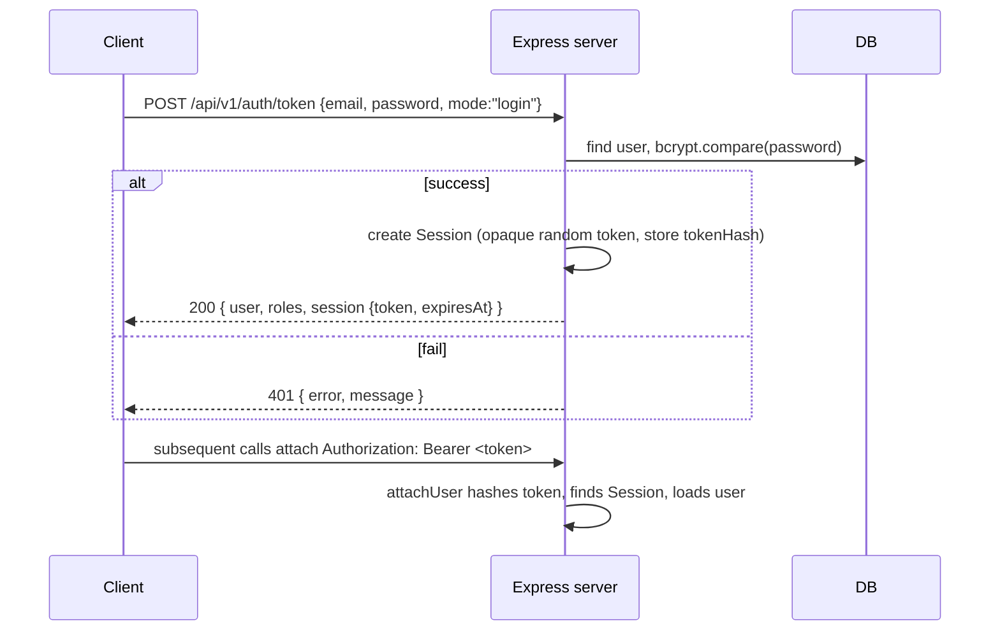
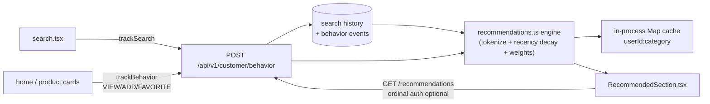

# GooCart — Developer Onboarding & Architecture Guide

> **How to read this document.** This is a **read-only audit** of the codebase as it
> actually exists today. Every claim below was verified against source. Where a feature
> is **NOT FOUND IN CODEBASE**, **IMPLEMENTATION INCOMPLETE**, **HARDCODED**, or **MOCK**,
> it is explicitly tagged so you never waste time hunting for code that does not exist.
>
> Begin with [§1 Codebase Map](#1-codebase-map), then [§2 Tech Stack](#2-tech-stack), then
> [§24 Where Do I Go?](#24-where-do-i-go) if you are looking for a specific feature.

---

## 1. Codebase Map

GooCart is a **monorepo** with one Express+Mongo backend, one Next.js (Admin) web app,
and **four** React Native / Expo client apps (customer, partner, vendor).

```
E:\Gocart\Goo-cart\
├── app\                          # Next.js 16 root web app  →  THE ADMIN DASHBOARD
│   ├── page.tsx                  # single 1094-line "use client" admin dashboard
│   └── api\[...path]\route.ts     # proxy: forwards /api/*  →  GOOCART_API_URL
├── public\                       # static assets for the root app
├── server\                       # Express + Mongoose backend (ESM, single source of truth)
│   └── src\
│       ├── index.ts              # app bootstrap + all route mounts + global middleware
│       ├── models.ts             # ALL Mongoose schemas in one file
│       ├── seed.ts               # seeds DB with users/products/restaurants/coupons
│       └── {lib,routes}\         # business logic + routers (see §9)
├── customer\                     # Expo RN app  →  END-USERS (food + multi-store)
│   ├── app\                      # expo-router file-based routes, incl. (tabs)
│   └── src\
│       ├── components\           # reusable UI (incl. cart/, RecommendedSection.tsx)
│       ├── services\             # API clients + domain services (PricingService, etc.)
│       ├── store\                # zustand stores (cart, auth, location, ...)
│       ├── theme\                # design tokens (colors, radius, spacing, typography)
│       └── types\                # shared TypeScript types
├── partner\                      # Expo RN app  →  DELIVERY RIDERS (socket-driven)
├── vendor\                       # Expo RN app  →  RESTAURANT VENDORS (socket-driven)
├── tests\                        # backend test files (run via server/ npm test)
├── scripts\                      # android build helpers
├── AGENTS.md / CLAUDE.md         # agent instruction files (repo intro + operations)
└── README.md                     # ⚠️ STALE vinext-starter boilerplate, NOT about GooCart
```

> **HARDCODED / STALE:** Root `README.md` is a leftover `vinext-starter` (Cloudflare)
> template and says nothing about GooCart. The authoritative intro lives in `AGENTS.md`.

---

## 2. Tech Stack

| Layer | Technology | Where it lives |
|---|---|---|
| Backend | Node `>=20`, **Express 4**, **Mongoose 8**, Socket.IO 4 | `server/` (`package.json`) |
| Backend runtime | ESM (`"type":"module"`), `tsx` for dev | `server/package.json` |
| Auth | `bcryptjs` password hashing, opaque session tokens | `server/src/lib/auth.ts` |
| Rate limit | `express-rate-limit`, `helmet`, `cors` | `server/src/index.ts` |
| Email/OTP | Gmail **API over HTTPS** (OAuth), `expo-server-sdk` for push | server `lib/` |
| DB | **MongoDB** (Mongoose) — URI + DB selected via two env vars | `server/src/models.ts` |
| Admin web | **Next.js 16.3.3**, React 19.2.6 (single-page dashboard) | root `app/` |
| Customer app | **Expo ~54**, React Native 0.81.5, React 19.1, expo-router 6 | `customer/` |
| State (customer) | **zustand** (persisted via AsyncStorage) | `customer/src/store/` |
| Realtime | `socket.io-client` (customer/partner/vendor) | each app's `src/` |
| Maps | `react-native-maps`, Google Places (server) + Nominatim fallback | customer + server |
| Icons | `@expo/vector-icons` (name-only set, see §14) | customer |
| Build | Expo EAS / `expo run:android`; root Next on Vercel; server on Render | `render.yaml`, `vercel.json` |

> **NOT FOUND IN CODEBASE:** There is **no SQLite** anywhere. All persistence is MongoDB
> via Mongoose. There is **no Redis**; the recommendation layer uses an in-process Map cache.

---

## 3. High-Level Architecture



**Key idea:** The **backend is the single source of truth** for catalog, orders,
pricing, coupons, recommendations. The **customer app** holds cart/coupon **state locally**
but prices everything through a shared `PricingService`. The **Admin web app owns no data** —
it proxies every request to the backend.

---

## 4. Admin Web App (Root Next.js)

- **What it is:** The backend's **Admin dashboard**, `app/page.tsx` (1094 lines, `"use client"`).
- **Auth:** POSTs to the backend (`/api/auth/login` and `/api/auth/signup`) via the proxy;
  stores the returned session; a role guard requires `role` to include `"ADMIN"`, otherwise it
  shows a fatal `NotAuthorized` screen.
- **Proxy:** `app/api/[...path]/route.ts` forwards every `/api/*` request to
  `GOOCART_API_URL` (default `https://goo-cart.onrender.com`), preserving method/body/headers.
- **Admin nav sections:** Dashboard · Live Orders · Live Operations · Orders · Rides ·
  Parcels · Vendors · Delivery Partners · Customers · Catalog · Discounts & Pricing ·
  Automation · Finance · Support · Reports · Settings.
- **NOT FOUND IN CODEBASE:** No other Admin UI exists. The **portal** (partner/vendor-facing
  web pages) is served by the backend `portalRouter` at `/api/goocart`, not by the root app.

---

## 5. Authentication Flow



**Session model (verified):**
- Sessions are **opaque random values**; the server stores only the **tokenHash**.
- `JWT_SECRET` is **reserved** (declared in `.env.example`) but **stateless JWTs are not
  currently issued**.
- Logout deletes the session document.

---

## 6. Roles & Route Guards

Roles observed in the auth layer and admin UI:

| Role | Meaning | Guard |
|---|---|---|
| `CUSTOMER` | end user | default for `/api/v1/customer/*` |
| `ADMIN` | admin dashboard access | `requireRole('ADMIN')` + root role-guard |
| `SUPER_ADMIN` | elevated admin | `requireRole` |
| `OPERATIONS_ADMIN` | ops/automation views | `requireRole` |
| `DELIVERY_PARTNER` | rider (partner app) | partner routes; client-enforced `WrongRoleError` |
| `VENDOR` | restaurant (vendor app) | vendor routes |

Seed emails that determine admin/vendor/partner on signup are configured via
`ADMIN_USER_EMAILS`, `VENDOR_USER_EMAILS`, `PARTNER_USER_EMAILS` (see §18).

---

## 7. Backend Route Mounts

From `server/src/index.ts` (verified):

| Mount path | Router | Notes |
|---|---|---|
| `/health` | inline | health check |
| `/api/v1/auth` **and** `/api/auth` | authRouter | same router mounted twice |
| `/api/v1/catalog` | catalogRouter | products, food, restaurants, services |
| `/api/v1/orders` | ordersRouter | orders + service-orders |
| `/api/v1/vendor` | vendorRouter | vendor scope |
| `/api/v1/admin` | adminRouter | admin scope (+ pricing/recommendation settings) |
| `/api/v1/partner` | partnerRouter | rider scope |
| `/api/v1/customer` | customerRouter | customer scope |
| `/api/v1/customer` | recommendedRouter | recommendations (mounted separately) |
| `/api/v1/notifications` | notificationsRouter | device/notification endpoints |
| `/api/goocart` | portalRouter | partner/vendor web portal |

Global middleware (registered first, in order): **helmet** (CSP off) → **cors** →
`express.json({ limit:'6mb' })` → per-request `connectDb` → `attachUser`.

---

## 8. Full API Inventory (Backend)

> `🔒` = requires auth. `A` = admin, `V` = vendor, `P` = partner, `C` = customer, `-` = public.

### Auth (`/api/v1/auth`, also `/api/auth`)
| Method & Path | Auth | Purpose |
|---|---|---|
| `POST /signup` | - | create account |
| `POST /login` | - | login, return session |
| `POST /token` | - | login/signup token (mode switch: `login` vs `signup`) |
| `POST /logout` | 🔒 | destroy session |
| `POST /request-otp` | - | OTP delivery (Gmail or log fallback) |
| `POST /verify-otp` | - | OTP verification |
| `GET /me` | 🔒 | current user/profile |

### Catalog (`/api/v1/catalog`)
| Method & Path | Auth | Purpose |
|---|---|---|
| `GET /services` | - | delivery services (FOOD, GROCERY, VEGETABLES, MART, BIKE_TAXI, PARCEL) |
| `GET /restaurants` | - | restaurant list |
| `GET /restaurants/:id` | - | restaurant detail + menu (food items) |
| `GET /products` | - | store products (multi-service) |
| `GET /products/:id` | - | store product detail |
| `GET /food` ... | - | food catalog variants (see actual route file) |

### Customer (`/api/v1/customer`)
| Method & Path | Auth | Purpose |
|---|---|---|
| `POST /orders` | 🔒 | food orders |
| `POST /service-orders` | 🔒 | **combined multi-service store order** |
| `POST /behavior` | 🔒 | record recommendation search/behavior signal |
| `GET /recommendations` | optional | personalized recommendations (guest → fallback) |
| `GET /order-history` / `GET /orders` | 🔒 | customer orders |
| location/profile endpoints | 🔒 | addresses, profile (see route file) |

### Orders (`/api/v1/orders`)
Order lifecycle, pricing, dispatch events (see §12 and `server/src/routes/orders.ts`).

### Admin (`/api/v1/admin`)
| Method & Path | Auth | Purpose |
|---|---|---|
| `GET/PATCH /pricing-settings` | 🔒A | global pricing settings |
| `GET/PATCH /recommendations-settings` | 🔒A | recommendation engine tuning |
| catalog/vendor/order management + analytics | 🔒A | admin CRUD/reporting |

### Vendor (`/api/v1/vendor`) — 🔒V
Menu/food maintenance, order acceptance, availability toggles.

### Partner (`/api/v1/partner`) — 🔒P
Rider login/availability, offer accept/reject, delivery progress.

### Notifications (`/api/v1/notifications`)
| Method & Path | Auth | Purpose |
|---|---|---|
| `POST /register-device` | 🔒 | register Expo push token |
| `POST /send` ... | 🔒 | send push (via `expo-server-sdk`) |

### Portal (`/api/goocart`) — portalRouter
Partner/vendor **web portal** pages (the thing served to browsers, distinct from the root Admin app).

> **Exercise caution:** endpoint details live in each router file. This table is the
> verified inventory; sub-paths/query params and response shapes must be read from
> `server/src/routes/*.ts` before coding against them.

---

## 9. Backend File Map (`server/src`)

`models.ts` — all Mongoose schemas (see §13). — `seed.ts` — seed/wipe DB.
`lib/` — `auth.ts` (sessions+roles), `pricing.ts` (authoritative bill/pricing),
`pricingSettings.ts`, `recommendations.ts` (recommendation engine + cache),
push/geocode/notification helpers. `routes/` — one file per scope: `auth.ts`,
`catalog.ts`, `customer.ts`, `orders.ts`, `admin.ts`, `vendor.ts`, `partner.ts`,
`notifications.ts`, `recommendations.ts`, `portal.ts`.

---

## 10. Cart (Customer App — Local State, Two Domains)

The customer app has **two independent persisted carts**:

| Cart | AsyncStorage key | Store | Content |
|---|---|---|---|
| **FOOD cart** | `goocart.cart.v1` | `useCartStore` | restaurant order (single-restaurant enforced) |
| **STORE cart** | `goocart.storecart.v1` | `useStoreCartStore` | **combined multi-service** order (Grocery + Vegetables + Mart) |

**FOOD cart (`useCartStore`)** API (verified): `addItem` (returns `{conflict}` on
cross-restaurant), `replaceCartWithItem`, `updateQty`, `removeLine`, `applyCoupon`
(upper-cases code), `removeCoupon`, `setTip`, `clear`, `hydrate`.

**STORE cart (`useStoreCartStore`)** API: `storeProductRef()` maps a service product →
`{ productId, service, name, imageUrl, price }`; `normalizeStoreService()` normalizes the
service string; also `addItem`, `updateQty`, `removeLine`, `applyCoupon`, `removeCoupon`,
`setTip`, `clear`, `hydrate`.

**Line-item shapes** (`customer/src/types/index.ts`): `CartLineItem` (food) and
`StoreCartLineItem`; a line is keyed by `cartLineId(foodItemId, variantId?, addonIds?)`.

> **Design note:** cart/coupon data is **client-side** and prices are recomputed through the
> shared `PricingService` (single source of truth) — the server re-validates on checkout.

---

## 11. Pricing, Coupons & Offers (Single Source of Truth)

After the pricing/offers audit+fix, **one authoritative implementation** exists:

- **Server:** `server/src/lib/pricing.ts` → `calculateBill(lines, coupon, tip, settings)`.
  - `discountBase = min(afterRestaurantDiscount, coupon.eligibleSubtotal ?? afterRestaurantDiscount)`
  - `FREE_DELIVERY` → `deliveryFee = 0`
  - `FLAT` → `min(value, discountBase)`
  - `PERCENT` → `rounded min(raw, maxDiscount)`
  - `FREE_DELIVERY` contributes `couponDiscount = 0`.
- **Global settings:** `server/src/lib/pricingSettings.ts`, tuned via
  `GET/PATCH /api/v1/admin/pricing-settings`.
- **Client mirror:** `customer/src/services/PricingService.ts` → `calculateBill` /
  `couponEligibility` / `couponDiscount` — deliberately kept identical to the server.

**Seed coupons (verified):** `GOO50` (PERCENT 50, min 299, max 100) · `FREEDEL`
(FREE_DELIVERY, min 199) · `WELCOME100` (FLAT 100, min 499).

**UI components:** `BillSummary`, `CouponSection` (auto-clears a stale applied coupon via an
effect; `notice` prop), `FreeDeliveryProgress` (`effective` prop), `RestaurantSummary`,
`StoreCartSection`, `EmptyCart`. Types `BillBreakdown` + `CouponEligibility` in types.

> **NOT FOUND IN CODEBASE:** There is no server-side coupon *issuance* (no "my coupons"
> balance); coupons are seed/static codes. Applicability is shared client+server validation.

---

## 12. Checkout → Order → Payment → Delivery (Verified Flows)

```mermaid
flowchart TD
  A[Customer cart] --> B[Checkout screen\ncustomer/app/checkout/*]
  B --> C{Payment method}
  C -->|Online| D["PAYMENT ✗ MOCKED\nno real gateway (SDK-confirmed)"]
  C -->|COD| E["No payment charge"]
  D --> F[POST /api/v1/customer/service-orders\n(food: /orders)]
  E --> F
  F --> G[Server creates Order, applies pricing,\nschedules dispatch]
  G --> H[Socket.IO events\n→ partner offer / vendor order]
  H --> I[Order lifecycle:\nplaced → accepted → picked → delivered]
```

- **Paid checkout is MOCKED** — there is **no real payment gateway** integration. Ordering
  with an "online" method does not actually charge a card.
- **COD** (cash-on-delivery) is the *real* path used for money at the door.
- **Combined store checkout** submits one `POST /api/v1/customer/service-orders` for a
  multi-service order (frontend builds the combined dual-domain cart, see §10).
- Order state transitions and realtime updates are driven by Socket.IO across customer,
  partner (rider), and vendor apps (see `partner/src` and `vendor/src` `socket.ts`).

---

## 13. Database Schema (MongoDB / Mongoose, `server/src/models.ts`)

Collections/models observed (non-exhaustive; read `models.ts` for exact fields):
`User`, `Session`, `OTP` (verification codes), `Restaurant` (`status`:
ACTIVE/SUSPENDED/DISABLED, `isOpen`), `FoodItem` (`available`), `Product`
(`service`, `stock`), `Order`, `ServiceOrder`, `Coupon`, `Address`, `Notification`,
`Device` (push tokens), plus **personalization** collections introduced by the
recommendation engine:

- `UserSearchHistory` — `userId+category+normalizedQuery` unique; `searchCount`,
  `firstSearchedAt`, `lastSearchedAt`.
- `UserBehaviorEvent` — `userId+category+eventType+refType+refId` unique; `count`,
  `lastAt`, `searchQuery`, `normalizedQuery`; `refType` enum `product/foodItem/restaurant`.
- `RecSettings` — singleton `_id:"recommendations"`: `enabled`, `count`, `fallbackCount`,
  `cacheSeconds`, `minSignal`, `weights{search, view, addToCart, purchase, favorite,
  recencyHalfLifeDays}`.

Service naming consistency (verified): `Product.service` is title-case
(`"Grocery"`/`"Vegetables"`/`"Mart"`); `SERVICE_NAMES` in `customer.ts` maps
GROCERY→"Grocery", VEGETABLES→"Vegetables", MART→"Mart", BIKE_TAXI→"Bike Taxi",
PARCEL→"Parcel".

---

## 14. Recommendation Engine ("Recommended For You")



**Reported implementation (verified in source):**
- **Personalization vs fallback:** authed users get weighted signals; guests get the
  deterministic popularity fallback.
- **Category isolation:** scoring is scoped per category (Food / Grocery / Vegetables / Mart)
  — signals in one category never leak into another.
- **Availability filtering:** recommends only `Product.stock > 0` and `FoodItem.available`
  with `Restaurant.status = ACTIVE`.
- **Recency weighting:** `exp(-ageDays / recencyHalfLifeDays)` decays older signals.
- **Event weights:** VIEW 0.6, ADD_TO_CART 1.5, REMOVE 0.2, PURCHASE 2.5, FAVORITE 1.2;
  search token build + `searchCount`-weighted queries.
- **Reason labels** surfaced on cards: "Based on your orders" / "From your cart" /
  "From your favourites" / "Similar to what you viewed" / "Based on your searches" /
  "Popular near you".
- **Caching:** in-process `Map` keyed `userId:category`, invalidated on any recorded signal
  (`clearRecommendationCache` / `invalidateUserCache`); TTL from `RecSettings.cacheSeconds`.

**Frontend wiring:**
- `customer/src/services/RecommendationService.ts` — `serviceToRecCategory`, `fetchRecommendations`,
  `trackSearch`, `trackBehavior` (fire-and-forget `.catch(()=>undefined)`).
- `customer/src/components/RecommendedSection.tsx` — reusable horizontal card strip;
  FOOD add via `useCartStore.addItem` (+ conflict Alert → `replaceCartWithItem`);
  STORE add via `storeProductRef` + `useStoreCartStore.addItem`; skeleton while loading;
  auto-hides when empty.
- `customer/app/(tabs)/home.tsx` — `<RecommendedSection category="food"/>` atop
  `FoodContent`; `<RecommendedSection category={serviceToRecCategory(config.type)}/>`
  atop `ProductContent`.
- `customer/app/(tabs)/search.tsx` — SEARCH + VIEW_RESTAURANT + VIEW_PRODUCT tracking.

> **Relationship to cart rules:** `RecommendedSection` respects the same cross-restaurant
> conflict rule and the same `storeProductRef` normalization as the rest of the app — a
> recommended item is just a shortcut to an identical add-to-cart action.

---

## 15. Search

`customer/app/(tabs)/search.tsx` is the search surface. It debounces input, queries the
catalog, and — as part of the recommendation work — records a **SEARCH** behavior signal via
`trackSearch(serviceToRecCategory(service ?? "FOOD"), query)`. Restaurant and food rows
additionally fire **VIEW_RESTAURANT** / **VIEW_PRODUCT** signals when navigated.

> **Query normalization** (`normalizeQuery`): lowercase, punctuation → space, collapse
> whitespace; **plurals are NOT** stripped (a known limitation — see §23).

---

## 16. Location, Geocoding & Distance

- **Customer:** `expo-location` + `react-native-maps`; maps keys
  `GOOCART_ANDROID_GOOGLE_MAPS_API_KEY` / `GOOCART_IOS_GOOGLE_MAPS_API_KEY` (client keys,
  must be restricted in Google Cloud Console before release builds).
- **Server (Bike Taxi / Parcel):** real address-search + driving-distance fares via
  `GOOGLE_PLACES_API_KEY` (Places + Distance Matrix). **Fallback:** free **Nominatim**
  geocoding + **haversine** distance when the key is blank. See `server/.env.example` notes.

---

## 17. Notifications & Realtime

- **Push:** `expo-server-sdk`; device push tokens registered at
  `POST /api/v1/notifications/register-device`. Gmail OAuth used only for OTP email.
- **Realtime:** Socket.IO server; `socket.io-client` in customer/partner/vendor. Order
  lifecycle and delivery progress events stream to the relevant app.

---

## 18. Environment Variables

### Root (Next Admin) — `.env.local`; prod = Vercel project env
| Var | Purpose |
|---|---|
| `GOOCART_API_URL` | backend the proxy forwards `/api/*` to |
| `DELIVERY_OFFER_TIMEOUT_SECONDS` | rider offer timeout (tuning) |
| `DELIVERY_INITIAL_RADIUS_KM` / `DELIVERY_MAX_RADIUS_KM` / `DELIVERY_RADIUS_STEP_KM` / `DELIVERY_MAX_OFFER_ATTEMPTS` | dispatch radius tuning |
| `DISPATCH_AVERAGE_CITY_SPEED_KMPH` (22) / `DISPATCH_TARGET_ARRIVAL_BUFFER_MINUTES` (3) | ETA tuning |

### Server — `.env.local` + `.env.email` (redacted values, see `server/.env.example`)
| Var | Purpose |
|---|---|
| `MONGODB_URI` | connection string **without** DB in path |
| `MONGODB_DB` | database name (kept separate from URI) |
| `PORT` | listen port |
| `JWT_SECRET` | **reserved** (sessions are opaque, not JWT) |
| `GMAIL_USER`/`GMAIL_CLIENT_ID`/`GMAIL_CLIENT_SECRET`/`GMAIL_REFRESH_TOKEN` | Gmail API OAuth for OTP email (− fallback to server log) |
| `ALLOWED_ORIGINS` | browser origins allowed; empty = allow all (dev) |
| `ADMIN_USER_EMAILS`/`VENDOR_USER_EMAILS`/`PARTNER_USER_EMAILS` | seed role assignment by email |
| `GOOGLE_PLACES_API_KEY` | Places + Distance Matrix (fallback: Nominatim + haversine) |

### Customer — `.env` (see `customer/.env.example`)
`EXPO_PUBLIC_API_URL`, `GOOCART_ANDROID_GOOGLE_MAPS_API_KEY`,
`GOOCART_IOS_GOOGLE_MAPS_API_KEY`.

> **Security note:** io keys are **public client credentials** and MUST be restricted
> (package/bundle + SHA-1) in Google Cloud Console; the server `GOOGLE_PLACES_API_KEY` must be
> a **different, server-side-restricted** key (see §20 and `.env.example` comments).

---

## 19. Client Storage & State (Customer App)

- **Persisted via AsyncStorage.** Verified keys: `goocart.cart.v1` (FOOD cart),
  `goocart.storecart.v1` (STORE cart), plus auth/backup token keys and other zustand
  per-request keys.
- **Secure token:** `expo-secure-store` for the session token.
- **Zustand stores** (`customer/src/store/`): cart stores + auth (token/session/ready) +
  location + favorites + notifications etc.
- **apiClient** (`customer/src/services/apiClient.ts`): central HTTP client with an
  `authReady` gate, `setAuthToken`/`markAuthReady`, error envelope (`ApiError`). All
  RecommendService/cart calls go through this; partners/vendors each have their own
  duplicated `apiClient.ts`/`useAuthStore.ts`/`SessionStorage.ts` (see §23 tech debt).

---

## 20. Security Findings

| Finding | Where | Classification |
|---|---|---|
| `JWT_SECRET` reserved, sessions are opaque+hashed | `server/src/lib/auth.ts` | ✅ good |
| `helmet` enabled but **CSP off** | `server/src/index.ts` | ⚠️ tighten for prod |
| `ALLOWED_ORIGINS` empty default = allow-all | `server/.env.example` | ⚠️ dev-only, set in prod |
| Client Maps keys are public — must be restricted | customer `.env` | ⚠️ release-gate |
| Server Places key must differ from client maps key | `server/.env.example` | ⚠️ release-gate |
| `express-rate-limit` present | `server/src/index.ts` | ✅ good (verify per-route coverage) |
| bcrypt password hashing | auth lib | ✅ good |
| No secrets committed (dotenv + gitignore, `.env.example` redacted placeholders) | repo | ✅ good |

> The "findings" are mostly **preventive release-gates**, not active vulnerabilities. Verify
> CSP, origin allow-list, and key restrictions before any public deployment.

---

## 21. Hardcoded / Mock / Incomplete Inventory

| Item | Status |
|---|---|
| `POST` online/paid **checkout** | **MOCK** (no real gateway; COD is the real money path) |
| Coupon **issuance / user coupon balance** | **NOT FOUND IN CODEBASE** (static seed codes only) |
| Root `README.md` | **STALE** (vinext-starter boilerplate, unrelated) |
| Server-side **Java/JWT tokens** | **IMPLEMENTATION INCOMPLETE** (JWT_SECRET reserved, unused) |
| Stripe/Razorpay/Razorpay-style payment models | **NOT FOUND IN CODEBASE** |
| SQLite | **NOT FOUND IN CODEBASE** |
| Recommendation **plural stripping** (`normalizeQuery`) | **HARDCODED** (not stripped) |
| Recommendation cache | **HARDCODED** (in-process Map, lost on restart; no Redis) |
| Admin UI location | only `app/page.tsx` (single file) + backend `portalRouter` web pages |

---

## 22. End-to-End User Journey (Customer)

1. Open Customer app → splash → intro/landing.
2. Auth via `POST /api/v1/auth/token` (login/signup, mode switch); session persisted
   (`expo-secure-store` + auth store).
3. Home tabs: **Food** (restaurants) and **Store** (Grocery / Vegetables / Mart via a
   service selector). Recommended sections render at the top when signals exist.
4. Browse/search → record search/VIEW behaviors.
5. Add food to the FOOD cart (single restaurant enforced); add store items to the
   combined STORE cart. ADD/FAVORITE events feed recommendations.
6. Apply a coupon, set a tip → `PricingService.calculateBill` (client) and server
   `calculateBill` on checkout agree.
7. Checkout → choose **COD** (real) or online (**MOCKED**) → place order:
   `POST /api/v1/customer/service-orders` (store) or `/orders` (food).
8. Realtime order lifecycle: rider offer → vendor accept → pickup → delivery; notifications
   via Expo push.

---

## 23. Tech Debt / Known Limitations

- **Duplicate API/state/session code** across customer/partner/vendor (`apiClient.ts`,
  `useAuthStore.ts`, `SessionStorage.ts` are copy-pasted, not shared).
- **Pluralization not handled** in recommendation `normalizeQuery` (search "samosas" vs
  "samosa" are different tokens).
- **In-process recommendation cache**: not shared across server instances, lost on restart;
  no Redis/distributed cache.
- **Admin dashboard is one giant 1094-line `page.tsx`** (componentization needed).
- **Server logic concentrated** in `models.ts` (all schemas) and route files; business rules
  are partially in `lib/`, partially inline in routes.
- **Root README stale** — onboarding relies on `AGENTS.md`/`CLAUDE.md` + this document.
- **Paid payments not integrated** (COD only for real money).

---

## 24. Where Do I Go? (Feature → File Guide)

| I want to change… | Start here |
|---|---|
| Add/change a DB collection | `server/src/models.ts`; export from `server/src/index.ts` if needed |
| Add/change an API endpoint | `server/src/routes/<scope>.ts`; mount in `server/src/index.ts` |
| Pricing / coupon math | `server/src/lib/pricing.ts` **and** `customer/src/services/PricingService.ts` (keep in sync) |
| Coupon seed codes | `server/src/seed.ts` |
| Recommendation scoring/cache/settings | `server/src/lib/recommendations.ts` + `RecSettings`-related endpoints |
| Recommended UI on home | `customer/src/components/RecommendedSection.tsx` + `customer/app/(tabs)/home.tsx` |
| Search behavior tracking | `customer/app/(tabs)/search.tsx` |
| Food cart | `customer/src/store/useCartStore.ts` |
| Store (multi-service) cart | `customer/src/store/useStoreCartStore.ts` |
| Checkout / order placement | `customer/app/checkout/*`, `orders/*`, `service-orders/[id].tsx` |
| Admin dashboard | root `app/page.tsx` (proxy in `app/api/[...path]/route.ts`) |
| Rider app | `partner/` |
| Vendor app | `vendor/` |
| Backend env config | `server/.env*.local`, `server/.env.example` |
| Root/Next env config | root `.env.local`, `.env.example` |
| Backend tests | `tests/` (run via `server/` npm scripts) |
| Android build helpers | `scripts/` |

---

## 25. Backend Command Cheatsheet (`server/`)

```
npm run dev            # tsx watch src/index.ts
npm run build          # tsc -p tsconfig.json
npm start              # node dist/index.js
npm test               # build + node --test test/*.test.mjs
npm run typecheck      # tsc --noEmit
npm run seed           # tsx src/seed.ts
npm run seed:reset      # tsx src/seed.ts --confirm-wipe
```

Customer: `npm start` (Expo). Root Admin: standard Next dev/build.

---

## 26. Top 30 Files to Know

1. `server/src/index.ts` — app bootstrap + mounts + middleware
2. `server/src/models.ts` — all schemas
3. `server/src/seed.ts` — seeding
4. `server/src/lib/auth.ts` — sessions/roles
5. `server/src/lib/pricing.ts` — authoritative bill/pricing
6. `server/src/lib/recommendations.ts` — recommendation engine + cache
7. `server/src/routes/customer.ts` — customer scope (incl. SERVICE_NAMES)
8. `server/src/routes/orders.ts` — order lifecycle
9. `server/src/routes/admin.ts` — admin + pricing/recommendation settings
10. `server/src/routes/catalog.ts` — products/food/restaurants
11. `server/src/routes/auth.ts` — auth endpoints
12. `server/src/routes/vendor.ts` / `13. partner.ts` / `14. notifications.ts` / `15. recommendations.ts` / `16. portal.ts`
17. `customer/src/services/apiClient.ts` — HTTP client + auth gate
18. `customer/src/services/PricingService.ts` — client pricing mirror
19. `customer/src/services/RecommendationService.ts` — rec client
20. `customer/src/store/useCartStore.ts` — FOOD cart
21. `customer/src/store/useStoreCartStore.ts` — STORE cart
22. `customer/src/components/RecommendedSection.tsx` — rec strip
23. `customer/app/(tabs)/home.tsx` — home tabs (Food + Store)
24. `customer/app/(tabs)/search.tsx` — search + tracking
25. `customer/app/(tabs)/cart.tsx` — dual-domain cart screen
26. `customer/src/theme/` — design tokens
27. `customer/src/types/index.ts` — shared types (incl. rec DTOs)
28. root `app/page.tsx` — Admin dashboard
29. root `app/api/[...path]/route.ts` — proxy
30. `partner/src/*` + `vendor/src/*` — rider/vendor apps (socket/state)
